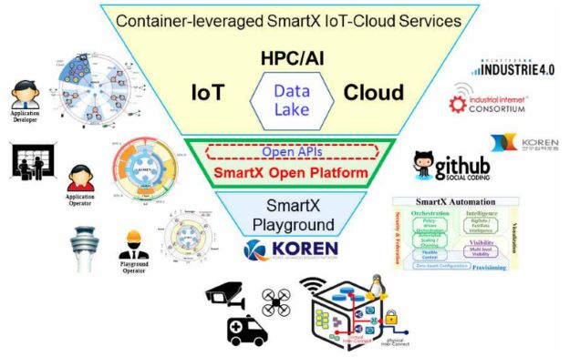
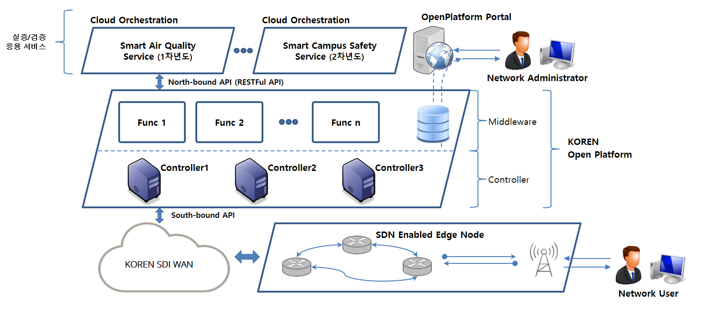

# KOREN SmartX_Open_Platform

  KOREN SmartX 오픈 플랫폼은 KUF(KOREN 연구협력포럼) 참여 대학교 컨소시엄을 중심으로 2017 ~ 2019년에 걸쳐 진행되는 KOREN SDI 고도화와 연계하면서 2017년부터 단계적으로 구축하고 있는 IoT-Cloud 서비스 대응 KOREN SmartX 오픈플랫폼은  <그림 1>과 제시한 대로 다음과 같은 특징을 가진다.

그림 1. 산업인터넷 확살을 위한 KOREN 오픈플랫폼의 단계별 실증

  국내 다수 기관(광주과학기술원, 제주대학교, KOREN NOC, 전남대학교, 건국대학교)에 산재한 IoT-Cloud 대응 SmartX Box(Type O/C/S)들을 KOREN을 통하여 10Gbps 속도로 연결하고 이들을 광주 과학기술원에 위치한 컨트롤타워에서 관제한다. 이를 통해 제공되는 KOREN SmartX Playground(공용개발환경)를 개발자들이 자유롭게 활용하면서, 분산된 드론과 스마트폰 등을 통하여 수집한 센서 및 동영상 데이터를 모아서 시각화를 제공하는 [Smart Air IoT-Cloud 서비스](https://github.com/KOREN-Platform/IoT-Cloud_Services/tree/master/Smart_Air_IoT_Cloud_Service)를 포함한 다양한 IoT-Cloud 서비스들을 마이크로서비스 구조의 컨테이너 기반으로 오픈소스 기반의 KOREN SmartX OpenPlatform을 활용하여 손쉽게 실증하는것이 가능하다.

## System Architecture

### Component Links
  
  * Service
     - [IoT-Cloud Application Services Workflow](https://github.com/KOREN-Platform/IoT-Cloud_Services/tree/master/IoT_Cloud_Service_Workflow)
     - [Smart Air IoT-Cloud Service](https://github.com/KOREN-Platform/IoT-Cloud_Services/tree/master/Smart_Air_IoT_Cloud_Service)
     - [Service Visualization & IoT data analysis tool](https://github.com/KOREN-Platform/IoT-Cloud_Services/tree/master/Service_Visualization_Analysis_Tool)
  
  * Control Tower
     - O+P Center
     - S Center
     - V Center

### Boxes
  * [O-Box](Software-Defined Access 대응)
  * C-Box(클라우드 대응)
  * S-Box(Software-Defined WAN 대응)

### Links
  - [상세가이드](https://goo.gl/xyXfpd)
  - [Collaboration_2017](https://github.com/KOREN-Platform/Collaboration_2017)
  - [Technical_Documents](https://github.com/KOREN-Platform/Technical_Documents)