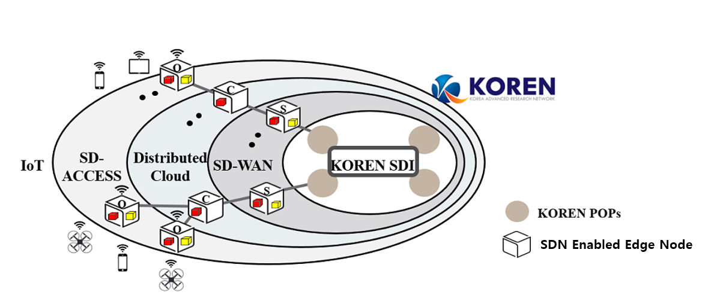

# KOREN SmartX_Open_Platform

 오픈소스 소프트웨어 기반으로 SDN/NFV/Cloud를 통합한 소프트웨어-정의 (Software-Defined) 인프라의 구축과 운용을 위한 오픈 플랫폼
## System Architecture
  * Main Architecture

  * Network Architecture

### Component Links
  
  * Service
     - [Smart Air IoT-Cloud Service](https://github.com/KOREN-Platform/IoT-Cloud_Services/tree/master/Smart_Air_IoT_Cloud_Service)
     - [Smart Campus Safety Service]
     - [Smart Disaster Safety Service]
  
  * Control Tower
     - O+P Center
     - S Center
     - V Center

  * Boxes
    - [O-Box](https://github.com/KOREN-Platform/SmartX_Playground/blob/master/Playground_Introduction_Guide/User_Guide/Type-O%20%EB%82%B4%EB%B6%80%20%EB%84%A4%ED%8A%B8%EC%9B%8C%ED%81%AC%20%EC%84%A4%EC%A0%95%20%EB%B0%8F%20%EC%8A%A4%ED%81%AC%EB%A6%BD%ED%8A%B8%20%EC%84%B8%EB%B6%80%20%EC%84%A4%EB%AA%85.pdf)
 : IoT와 Cloud 사이에 위치하여 유연한 연결성을 제공하는 SD-Access의 적용을 위한 Box. Type O SD-Access Box는 와이파이 및 유선 연결을 통해 드론, 스마트폰과 같은 IoT 기기들에게 네트워킹을 제공하며, 관제타워의 SD-Access SDN 제어기의 제어 하에 IoT 어플리케이션이 생성하는 데이터를 클라우드로 전달하는 역할을 한다.
    - C-Box(클라우드 대응)
    - S-Box
 : ONOS SDN 제어기를 기반으로 Server와 Switch 파트를 한 하드웨어에 담고 있는 형태의 융합형 자원 Box

### Links
  - [Playground User Guide](https://github.com/KOREN-Platform/SmartX_Playground/blob/master/Playground_Introduction_Guide/User_Guide/readme.md)
  - [상세가이드](https://goo.gl/xyXfpd)
  - [Collaboration_2017](https://github.com/KOREN-Platform/Collaboration_2017)
  - [Technical_Documents](https://github.com/KOREN-Platform/Technical_Documents)